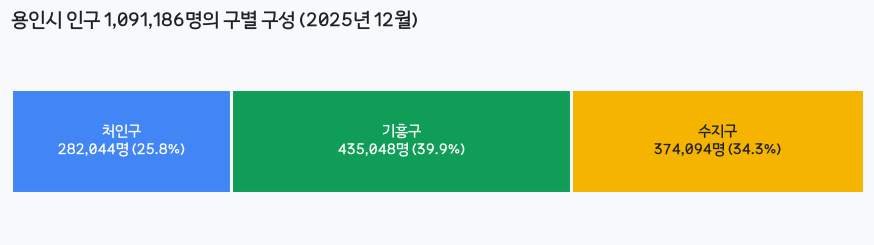
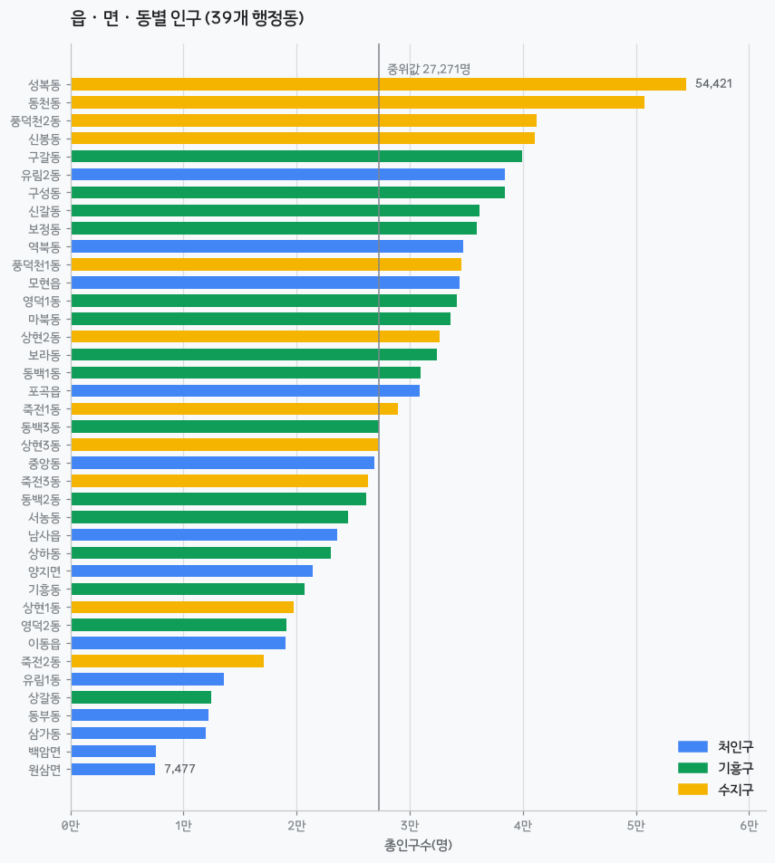
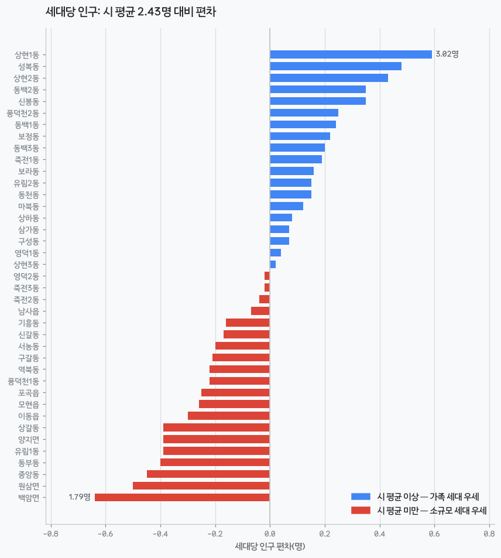
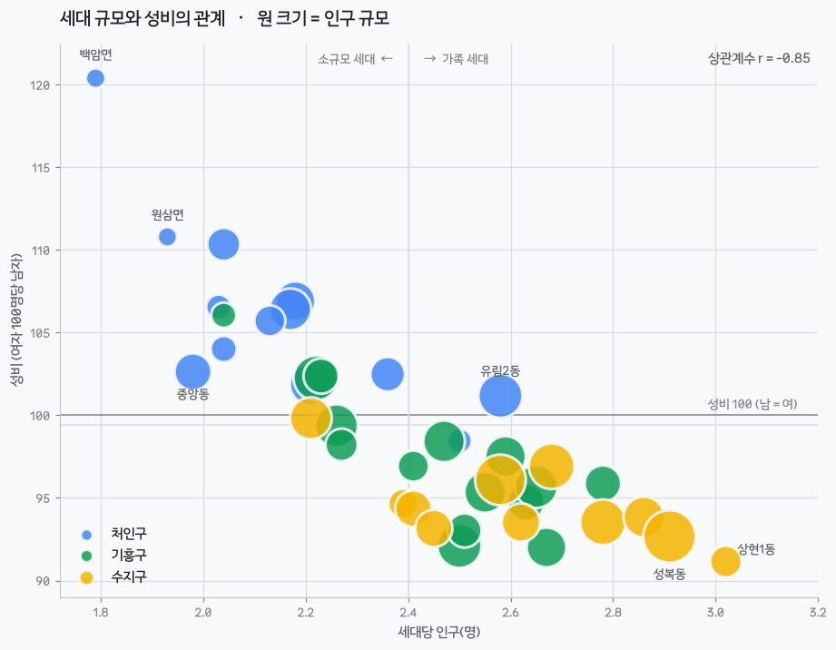
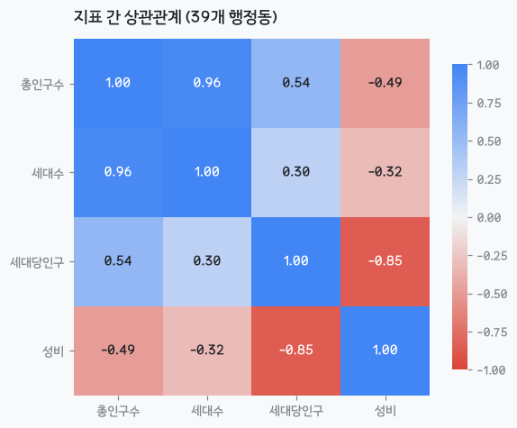
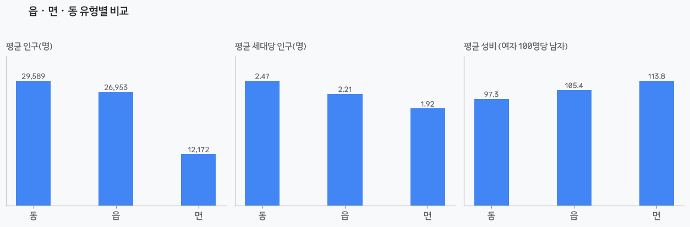

# 용인시 인구 현황 분석 보고서 (초안)

**부제 — 109만 도시 안의 세 도시: 세대 구조로 다시 그린 용인시 정책 지도**

| | |
|---|---|
| 작성자 | (이름) |
| 작성일 | 2026-00-00 |
| 분석 데이터 | 행정안전부 주민등록 인구통계 `202512_202512_주민등록인구및세대현황_연간.csv` |
| 기준 시점 | 2025년 12월 |
| 공간 범위 | 경기도 용인시 (처인구·기흥구·수지구, 39개 읍·면·동) |
| 정책 대조 자료 | 용인특례시 『2025 주요업무 추진계획 [제1부시장 소관]』 (→ 5.2 자료목록) |
| 분석 노트북 | [data_analysis.ipynb](data_analysis.ipynb) |
| 사용 도구 | Python(pandas · matplotlib · plotly · folium) |

---

## 0. 요약 (Executive Summary)

> **용인시는 인구 109만의 한 도시가 아니라, 세대 구조와 성비가 전혀 다른 세 개의 지역이
> 한 행정구역에 묶여 있는 도시다. 따라서 주민 정책도 '시 전체 평균'이 아니라 '지역 유형별'로 설계해야 한다.**

- 용인시 총인구는 **1,091,186명**, 44.9만 세대, 세대당 **2.43명**, 성비 **98.1**(여자 100명당 남자)이다.
- 인구는 극단적으로 쏠려 있다. 상위 10개 동(전체 39개의 26%)에 인구의 **37.7%**가 모여 있고,
  1위 성복동(54,421명)과 최하위 원삼면(7,477명)의 격차는 **7.3배**다.
- **핵심 발견:** 세대당 인구와 성비는 **r = −0.85**의 강한 음의 상관을 보인다.
  가족 세대가 많은 동일수록 여자가 많고, 소규모 세대가 많은 동일수록 남자가 많다.
- 이 두 지표로 39개 동을 4개 유형으로 나누면, **인구의 58%가 '가족중심·여성우위' 유형 20개 동**에 집중된다.
- 정책 함의: 보육·교육 수요는 수지·기흥 신도시에, 1인가구 돌봄과 접근성 보장은 처인구 읍·면과 원도심에
  각각 다르게 배분해야 한다. 인구 비례 배분만으로는 인구 12.9%인 하위 10개 동이 구조적으로 후순위가 된다.
- **실제 정책과 대조한 결과(5.2):** 용인시는 이미 **면적·접근성 기반 배분**을 보건 인프라에서 실행하고 있다
  (처인구 보건지소 6 + 보건진료소 7 ↔ 수지구 0). 반대로 **1인가구·돌봄 정책은 사업은 많지만 지역 배분 기준이 없고**,
  육아시간 지원인력은 수요(처인 24명 : 기흥 37명 : 수지 36명)와 무관하게 **구별 2명씩 균등 배분**된다.
  즉 문제는 "정책이 없다"가 아니라 **"지역 유형별 배분 기준이 없다"**는 것이다.

---

## 1. 왜 이 분석을 했는가

나는 용인시(수지구)에 살고 있다. 같은 시민이지만 옆 구인 처인구에 가면 도시의 느낌이 완전히 다르다.
"체감상 다른 이 차이가 데이터로도 확인되는가, 그리고 그 차이가 시청·구청 정책에 반영되어 있는가"가
이 분석의 출발점이다.

### 분석 질문
1. **규모** — 용인시 인구·세대는 어디에 얼마나 몰려 있는가? 구·동 간 격차는 얼마나 큰가?
2. **세대 구조** — 세대당 인구로 볼 때 '가족 중심 동'과 '소규모 세대 동'은 어디인가?
3. **성비** — 남녀 균형이 깨진 지역은 어디이며, 세대 구조와 어떤 관계가 있는가?
4. **유형화** — 위 지표를 조합해 39개 동을 몇 가지 정책 유형으로 묶을 수 있는가?
5. **정책** — 유형별로 시청·구청이 우선해야 할 주민 정책은 무엇인가?

---

## 2. 데이터와 방법

### 2.1 데이터
- 출처: 행정안전부 주민등록 인구통계 (jumin.mois.go.kr)
- 구성: 43행 × 7열 — 시 합계 1행, 구 3행, 읍·면·동 39행
- 변수: 총인구수, 세대수, 세대당 인구, 남자 인구수, 여자 인구수, 남여 비율

### 2.2 전처리에서 실제로 걸린 문제
| 문제 | 해결 |
|---|---|
| CP949 인코딩 → 한글 깨짐 | `pd.read_csv(..., encoding='cp949')` |
| 숫자에 천단위 콤마 → 문자열로 읽힘 | `thousands=','` |
| `행정구역` 한 칸에 계층+행정코드가 뭉쳐 있음 | 정규식으로 괄호 안 코드 분리 |
| `경기도 경기도 용인시`처럼 상위 지명 중복 표기 | 연속 중복 토큰 제거 후 토큰 수로 계층 판정 |
| 시 합계 행이 구·동 집계에 이중 계상될 위험 | `구분`(시/구/읍면동) 컬럼으로 계층 분리 후 각각 집계 |

> 검증: 구 3개 합계 = 시 합계 (인구 1,091,186 / 세대 448,730) 일치 확인.

### 2.3 파생 변수
- **성비** = 남자 ÷ 여자 × 100 (여자 100명당 남자 수)
- **여성비율** = 여자 ÷ 총인구 × 100
- **시_인구비중** = 해당 지역 인구 ÷ 시 전체 인구 × 100
- **유형** = 행정동명 끝글자 기준 읍 / 면 / 동
- **세대당인구_편차** = 세대당 인구 − 시 평균(2.43)

### 2.4 세대당 인구를 왜 핵심 지표로 삼았는가
이 데이터에는 연령·가구유형 정보가 없다. 그래서 **세대당 인구를 가구 형태의 대리지표(proxy)** 로 사용했다.
- 높다(2.7명↑) → 자녀 있는 가족 세대 비중이 높다 → 보육·교육·통학 수요
- 낮다(2.0명↓) → 1~2인 세대 비중이 높다 → 1인가구 돌봄, 소형주택, 생활안전 수요

이는 **해석**이며 관측이 아니다 (→ 6장 한계 참조).

---

## 3. 현황 분석

### 3.1 용인시 한눈에

| 지표 | 값 |
|---|---|
| 총인구수 | **1,091,186명** |
| 세대수 | 448,730세대 |
| 세대당 인구 | 2.43명 |
| 남자 / 여자 | 540,342명 (49.5%) / 550,844명 (50.5%) |
| 성비 | 98.1 (여자가 10,502명 많음) |
| 행정동 | 39개 (동 32 / 읍 4 / 면 3) |

인구 100만을 넘는 **특례시** 규모다.

> **주의 — 행정동 수가 시 공식문서와 1개 다르다.**
> 이 데이터(2025년 12월)는 **39개(동 32)** 인데, 용인시 『2025 주요업무 추진계획(제1부시장 소관)』은
> 세 곳에서 **38개 읍·면·동 / 31개 동**으로 표기한다
> (읍면동 소통간담 "38개 읍면동", 주민자치센터 홈페이지 "3개 구 31개 동", 지역사회보장협의체 "37개 읍.면.동").
> 차이는 **처인구 유림1동(13,538명)·유림2동(38,396명)** 으로 보인다 — 같은 시 문서가 스마트도서관 위치를
> "유림동 유방어린이공원"이라고 **단일 '유림동'** 으로 적고 있어, 유림동 분동이 데이터에는 반영되고
> 문서에는 아직 반영되지 않은 것으로 추정된다. **단정할 근거는 없어 확인 대상으로 남긴다.**
> → 이 추정이 맞다면 5.1의 제안 5번(분동 검토)은 **이미 실행된 선례가 있는** 제안이 된다(5.2.2 ④ 참조).

### 3.2 3개 구, 3개의 다른 도시

| | 처인구 | 기흥구 | 수지구 |
|---|---|---|---|
| 인구 | 282,044 (25.8%) | **435,048 (39.9%)** | 374,094 (34.3%) |
| 세대수 | 129,138 | 177,169 | 142,423 |
| 세대당 인구 | **2.18명 (최저)** | 2.46명 | **2.63명 (최고)** |
| 성비 | **104.7 (남자 우위)** | 96.9 | **94.7 (여자 우위)** |
| 여성비율 | 48.8% | 50.8% | 51.4% |
| 성격 | 넓은 농촌·산업 지역, 소규모 세대 | 최대 인구, 혼합형 | 가족·주거·교육 중심 |

기흥구가 가장 크지만, **면적을 감안하면 이야기가 뒤집힌다.** 처인구는 용인시 면적의 대부분을 차지하는데
인구는 4분의 1뿐이다. 즉 처인구는 넓고 흩어진 지역, 기흥·수지구는 좁고 밀집한 지역이다.

### 3.3 인구는 한쪽으로 쏠려 있다

| 집중도 지표 | 값 |
|---|---|
| 상위 5개 동 비중 | 20.8% |
| 상위 10개 동 비중 | **37.7%** (전체 39개 중 26%) |
| 하위 10개 동 비중 | 12.9% |
| 최대/최소 격차 | **7.3배** (성복동 54,421명 ↔ 원삼면 7,477명) |
| 중위값 / 평균 | 27,271명 / 27,979명 |

**인구 상위 5개 동** — 성복동(수지) 54,421 · 동천동(수지) 50,787 · 풍덕천2동(수지) 41,219 ·
신봉동(수지) 41,065 · 구갈동(기흥) 39,961
**인구 하위 5개 동** — 원삼면(처인) 7,477 · 백암면(처인) 7,584 · 삼가동(처인) 11,941 ·
동부동(처인) 12,230 · 상갈동(기흥) 12,481

상위권은 수지·기흥의 동이 독점하고, 하위권은 대부분 처인구 읍·면이다.
같은 '용인시민'이라도 **행정 서비스 수요의 밀도가 완전히 다르다.**

### 3.4 세대 구조의 양극

| | 동 | 세대당 인구 |
|---|---|---|
| 상위 | 수지구 상현1동 | **3.02명** |
| | 수지구 성복동 | 2.91명 |
| | 수지구 상현2동 | 2.86명 |
| | 기흥구 동백2동 / 수지구 신봉동 | 2.78명 |
| 하위 | 처인구 백암면 | **1.79명** |
| | 처인구 원삼면 | 1.93명 |
| | 처인구 중앙동 | 1.98명 |
| | 처인구 동부동 | 2.03명 |

동별 최대·최소 격차는 **1.7배(3.02 ↔ 1.79)**. 상위권은 대단지 아파트 신도시,
하위권은 농촌 지역과 원도심이다.

### 3.5 핵심 발견 — 세대 규모와 성비는 함께 움직인다

| 지표쌍 | 상관계수 |
|---|---|
| 총인구수 ↔ 세대수 | 0.96 |
| **세대당 인구 ↔ 성비** | **−0.85** |
| 총인구수 ↔ 세대당 인구 | 0.54 |
| 총인구수 ↔ 성비 | −0.49 |

**세대당 인구와 성비의 상관은 r = −0.85로 매우 강하다.**

- **성비 최고** — 처인구 백암면 120.4 · 원삼면 110.8 · 양지면 110.3
  → 세대당 인구도 1.8~2.0명대. 농촌·산업단지 지역으로 **1인 남성 세대**가 많은 구조로 읽힌다.
- **성비 최저** — 수지구 상현1동 91.2 · 기흥구 동백1동 92.0 · 구성동 92.1
  → 세대당 2.5~3.0명의 대단지 아파트. 여성·아동 인구가 두터운 **가족 정착 지역**이다.
- 39개 동 중 성비 100 초과(남자 우위)는 15개, 100 미만(여자 우위)은 24개다.
- 인구 규모와 성비도 r = −0.49 → **작은 동일수록 성비 불균형이 심하다.**

> 실무적 함의: **세대당 인구 하나만 봐도 그 동의 인구 구조를 상당히 예측할 수 있다.**
> 연령 데이터를 구하기 전이라도 세대당 인구를 정책 배분의 1차 스크리닝 지표로 쓸 수 있다.

### 3.6 도농 격차가 성비로 드러난다

| 유형 | 개수 | 평균 인구 | 평균 세대당 인구 | 평균 성비 |
|---|---|---|---|---|
| 동 | 32 | 29,589명 | 2.47명 | 97.3 |
| 읍 | 4 | 26,953명 | 2.21명 | 105.4 |
| 면 | 3 | **12,172명** | **1.92명** | **113.9** |

면 지역은 인구가 동의 41% 수준인데 성비 불균형은 압도적으로 크다. 읍은 그 중간의 **전이 지대**다.

### 3.7 인터랙티브 자료
- [images/07_트리맵.html](images/07_트리맵.html) — 구 > 동 계층 인구 트리맵 (색 = 세대당 인구)
- [images/08_버블차트.html](images/08_버블차트.html) — 세대 규모 vs 성비 호버 버블 차트

---

## 4. 지역 유형화 — 39개 동, 4개 정책 유형

세대당 인구(평균 2.40명)와 성비(평균 99.4)를 기준선으로 사분면을 만들면 39개 동이 4개 그룹으로 정리된다.

| 유형 | 동 수 | 인구 | 인구 비중 | 성격 | 우선 정책 방향 |
|---|---|---|---|---|---|
| **가족중심 · 여성우위** | 20 | 635,442 | **58.2%** | 수지·기흥 대단지 아파트 신도시 | 보육·초등 돌봄, 학교 신설, 통학 안전, 여성·아동 안전 |
| **소규모세대 · 남성우위** | 15 | 343,300 | 31.5% | 처인구 읍·면·원도심 + 기흥 역세권 | 1인가구 돌봄, 소형 주택, 대중교통, 산업단지 근로자 지원 |
| **소규모세대 · 여성우위** | 3 | 74,048 | 6.8% | 기흥 신갈·기흥동, 수지 죽전2동 (노후 주거) | 고령 1인가구 돌봄, 원도심 재생, 생활 SOC |
| **가족중심 · 남성우위** | 1 | 38,396 | 3.5% | 처인구 유림2동 (신규 개발지) | 정착 가족 인프라 조기 확충 |

**유형별 소속 동**

- **가족중심·여성우위 (20)** — 성복동, 동천동, 풍덕천2동, 신봉동, 구성동, 보정동, 영덕1동, 마북동,
  상현2동, 보라동, 동백1동, 죽전1동, 동백3동, 상현3동, 죽전3동, 동백2동, 상하동, 상현1동, 영덕2동, 삼가동
- **소규모세대·남성우위 (15)** — 구갈동, 역북동, 풍덕천1동, 모현읍, 포곡읍, 중앙동, 서농동, 남사읍,
  양지면, 이동읍, 유림1동, 상갈동, 동부동, 백암면, 원삼면
- **소규모세대·여성우위 (3)** — 신갈동, 기흥동, 죽전2동
- **가족중심·남성우위 (1)** — 유림2동

> 인구의 **58%가 '가족중심·여성우위' 유형**에 집중돼 있고, 반대편 극단인 처인구 읍·면은
> 동 수는 많지만 인구가 적어 **효율 논리로는 늘 후순위로 밀리는** 구조다.

---

## 5. 정책 제안과 실제 정책 대조

### 5.1 데이터에서 도출한 정책 제안

| # | 근거 (데이터) | 정책 제안 | 대상 지역 |
|---|---|---|---|
| 1 | 세대당 인구 2.8명↑ 동이 수지·기흥에 집중 (상현1동 3.02, 성복동 2.91) | 국공립 어린이집·초등 돌봄교실·학교 신설 우선 배치, 통학로 안전 | 상현1·2동, 성복동, 신봉동, 동백2동 |
| 2 | 면 지역 성비 113.9, 세대당 1.92명 | 1인 남성 세대·산업단지 근로자 주거·의료·문화 접근성 개선 | 백암면, 원삼면, 양지면 |
| 3 | 처인 원도심 세대당 2.0명 내외 (중앙동 1.98, 동부동 2.03) | 고령 1인가구 안전 확인·생활지원, 원도심 재생 | 중앙동, 동부동, 유림1동 |
| 4 | 인구 하위 10개 동 합계 12.9% | 인구 비례가 아닌 **면적·접근성 기반** 서비스 배분(순회 민원버스, 이동 보건소) | 처인구 읍·면 전역 |
| 5 | 최대/최소 동 인구 7.3배 격차 | 행정동 분동·통합 검토, 주민센터 인력 재배치 | 성복동·동천동(분동) / 원삼면·백암면(통합 서비스) |
| 6 | 여자가 10,502명 많음, 수지구 성비 94.7 | 여성 안전(CCTV·안심귀갓길), 경력단절여성 재취업 지원 | 수지구 전역 |

### 5.2 용인시 실제 정책과의 대조

#### 5.2.0 사용한 정책 자료

| # | 자료명 | 발행 | 포함 범위 |
|---|---|---|---|
| A | 『2025 주요업무 추진계획 [제1부시장 소관]』 | 용인특례시 (홈페이지 공개) | 시민소통관·감사관·공보관·법무담당관·청년담당관·기획조정실·재정국·교육문화체육관광국·복지여성국·경제산업국·농림축산국·농업기술센터·3개구 보건소·도서관사업소 |

> **자료의 범위 한계:** 자료 A는 **제1부시장 소관**만 담고 있다. 도시계획·주택·교통·환경·건설·안전 분야는
> 제2부시장 소관으로 추정되며 이 자료에 없다. 따라서 아래 표에서 **교통**과 **주거·도시재생**은
> 판정을 보류(⏸)했고, 해당 자료를 확보하면 갱신한다.
> 또한 자료 A에는 **읍·면·동 단위 예산 배분표가 없다.** "인구 58%가 몰린 유형에 예산도 그만큼 가는가"라는
> 질문은 용인시 예산서(세출 사업별 설명서)를 추가로 확보해야 답할 수 있다.

#### 5.2.1 분야별 대조표

판정 기준 — **정합**: 내 제안 방향과 사업이 일치 / **부분정합**: 사업은 있으나 대상 지역·배분 기준이 다름 /
**공백**: 해당 사업이 자료에 없음 / **⏸**: 자료 범위 밖

| 분야 | 확인한 실제 정책·사업명 | 대상 지역 | 예산·규모 | 내 분석과의 정합성 |
|---|---|---|---|---|
| **보육·교육** | 용인형 미래교육협력지구(24개 세부사업) | 관내 194개교 **전역 균등** | 7,392백만원 (시 4,948 / 교육청 2,444) | **부분정합** — 사업 규모는 크나 배분이 학교 수 기준. 세대당 인구 3.0명 동과 1.8명 동에 같은 기준 적용 |
| | 어린이집 냉난방비 인상 지원 | 630개소 전역 | 751백만원 (개소당 20만원 균등) | **부분정합** — "개소당 균등"이 명시. 원아 수·지역 수요 미반영 |
| | 흥덕청소년문화의집 운영 + 기흥국민체육센터(수영장·다목적체육관) | **기흥 영덕동 1209** (동일 부지) | 2,397백만원(건립 총 21,150) + 운영비 3,429백만원 | **정합** — 영덕1동 세대당 **2.47명**·성비 98.4, 가족중심·여성우위 유형. 청소년+체육 시설을 한 부지에 묶은 배치 |
| | 신봉도서관 건립 (**'트윈세대' 12~16세 특화**) | **수지 신봉동** | 총 16,234백만원, '26.4 준공 | **강한 정합** — 신봉동 세대당 **2.78명**, 4장 '가족중심·여성우위' 유형. 특화 주제까지 인구구조와 일치 |
| | 처인성 어울림센터(학교복합시설) 운영 | **처인 남사읍** (처인고 내) | 450백만원, 청소년미래재단 위탁 | **역방향(주목)** — 남사읍은 소규모세대·남성우위 유형. 데이터만 보면 후순위인데 시 최초 학교복합시설이 여기 |
| | 다함께돌봄센터 / 지역아동센터 ('24 실적) | 22개소 / 34개소 | 3,285백만원 / 6,363백만원 | **확인필요** — 개소별 소재지 미기재. 동별 분포 확인 필요 |
| **1인가구·돌봄** | 민관협력 위기가구 발굴 — **1인가구 실태조사 12,000가구**, AI안부든든 300가구 | **지역 미지정** | 110백만원(시비) | **부분정합** — 1인가구를 정책 대상으로 인식하고 있으나 대상 지역 기준 없음 |
| | 중장년 1인가구 주민주도 마을복지사업 ('24) | 6개 사업 | 77명 / 54백만원 | **부분정합** — 규모가 작고 소재지 미기재 |
| | "혼자지만, 함께" **1인 청년가구 지원** *(신규)* | 지역 미지정 | 160명 / 20백만원 | **정합** — 소셜다이닝·마음돌봄·집수리 교육. 1~2인 세대 밀집지에 배치하면 효과 극대화 |
| | 사회적 고립청년 지원사업 *(신규, 조례 제정)* | 18~39세 | 50백만원 | **정합** |
| | 고령 어르신 동행 서비스 *(신규)* | 70세 이상 | 55백만원 (고향사랑기금), 2시간 1만원 | **정합** — 병원·관공서 동행. 접근성 취약지(면 지역)에 우선 배치 근거 있음 |
| | 슬기로운 스마트경로당 *(신규)* | 경로당 60개소 | 1,544백만원 | **확인필요** — 60개소 소재지 미기재 |
| | 노인맞춤돌봄 / 독거노인 응급안전안심 ('24) | 3,960명 / 2,893가구 | 6,445백만원 / 638백만원 | **정합** — 규모 최대. 지역 배분 확인 필요 |
| | 독거 중증 재가장애인 안전기능 강화 *(신규)* | 174명 | 1,533백만원 | **정합** |
| | 「장애인 온종일 돌봄센터」 | **처인 백암면** (해든솔) | 114백만원, 정원 4명 | **정합** — 백암면은 성비 120.4·세대당 1.79명으로 39개 동 중 양 극단. 돌봄 인프라를 여기 둔 것은 접근성 기반 배치 |
| | 다목적복지회관 운영 활성화 *(신규)* | **기흥 구갈 / 처인 모현** | 120백만원 | **정합** — 모현읍(소규모세대·남성우위)에 여가·체력단련 확대 |
| **주거·도시재생** | 청년 주거 점프(JUMP) — 월세→전세→내집마련 3단계 | 지역 미지정 | 월세 2,099명 3,863백만원 / 전월세보증금 267명 199백만원 / **생애 첫 주택구입 이자 신규 1억원(100명)** | ⏸ **부분정합** — 청년 주거 사다리는 체계적. 단 1인가구 소형주택 공급 정책은 자료 범위 밖 |
| | 동부지역 여성복지회관 건립 | **처인 마평동** | 63,237백만원, '25 공정 15%, '27.5 준공 | **정합** — 처인 원도심 최대 생활SOC 투자 |
| | 장애인회관 건립 | **처인 마평동** (여성복지회관 부지 내) | 23,060백만원, '28.5 준공 | **정합** |
| | 소형주택 공급·원도심 재생 | — | — | ⏸ **자료 범위 밖** (제2부시장 소관 추정) |
| **교통** | 구갈상점가 공영주차장 건립 | **기흥 구갈동** | 15,000백만원 (국 5,988/시 9,012), 145면 | ⏸ 상권 활성화 목적. 대중교통 정책 아님 |
| | 콜센터 AI 보이스봇 (24시간 민원) | 전역 | 34백만원 | **정합(간접)** — 야간·원거리 주민의 행정 접근성 보완 |
| | 순회 민원버스·대중교통 확충 | — | — | ⏸ **자료 범위 밖.** 5.1 제안 4번의 핵심이라 확인 필요 |
| **여성·안전** | 함께 만드는 양성평등, 생활 속 안심 지원 | 전역 | 70백만원 — 양성평등교육 8,000명, **여성 안심패키지 160명**, 가드캠·비상출동 30명, 일시보호 30명 | **정합** — 5.1 제안 6번과 사업 내용 일치 |
| | 여성친화도시 **3회 연속 지정**(2024~2028, 여성가족부) | 전역 | 양성평등기금 17개 사업 187백만원 | **정합** — 여성 정책 기반이 이미 제도화 |
| | 안심무인택배 보관함 ('24) | 13개소 | — | **확인필요** — 13개소 위치 미기재. 성비 최저 동(상현1동 91.2)과 겹치는지 확인 |
| | 경력보유여성 공공일자리 / 새일여성인턴 | 지역 미지정 | 19명 328백만원 / 25명 115백만원 | **정합** — 규모는 작음 |
| | 스토킹·교제폭력 피해자 일상회복 지원 | 전역 | 가드캠 30명, 임시숙소 30명 | **정합** |
| **도농 균형** | **백암면 기초생활거점 육성사업** — 공중목욕시설·커뮤니티 공간 | **처인 백암면** + 배후 12개리 | 4,000백만원 (국 2,800/시 1,200), '24~'26 | **강한 정합** — 백암면은 세대당 **1.79명(최저)**, 성비 **120.4(최고)**. 공중목욕시설은 1~2인 세대 생활편의의 정확한 처방 |
| | 원삼면 기초생활거점 준공 ('24.8) | **처인 원삼면** | 4,405백만원 | **강한 정합** — 원삼면은 인구 **7,477명(최하위)**, 세대당 1.93명 |
| | 처인구보건소 조직 — **보건지소 6 + 보건진료소 7** | 모현·이동·남사·원삼·백암·양지 | (기흥 진료소 2 / **수지 0**) | **결정적 정합** — 인구는 처인 25.8% < 수지 34.3%인데 보건 거점은 13 : 0. **면적·접근성 기반 배분이 이미 실행 중** |
| | 찾아가는 농촌지역 응급처치 교육 *(공약)* | **처인구 읍·면 주민** | 3백만원, 연 10회 | **정합** — 5.1 제안 4번(이동형 서비스)과 직결 |
| | 농어민 기회소득 *(공약)* | 농어민 13,200명 | 11,126백만원 (도 5,563/시 5,563) | **정합** — 처인 읍·면에 사실상 집중되는 최대 규모 이전소득 |
| | Farm & Forest 타운 조성 *(공약)* | **처인 백암면** | 총 74,700백만원, '26.6 준공 | **정합(단, 성격 다름)** — 주민 생활서비스가 아니라 관광·휴양 인프라 |
| | 마을형 공동퇴비사 *(신규)* | 소규모 축산농가 223호 | 1,000백만원 | **정합** — 면 지역 생활환경(악취) 개선 |
| | 마을세무사 / 스마트도서관 | 처인4·기흥5·수지4 / '25 역북(처인)·마북(기흥)·상하(기흥) | — | **부분정합** — 마을세무사는 구별 균등, 스마트도서관은 기흥 편중 |

#### 5.2.2 데이터로 예측하지 못했던 것 — 자료에서 새로 발견한 3가지

**① 시 스스로 처인구를 '기피 지역'으로 문서화하고 있다**
직원 통근버스 확대 운영 사업의 기대효과에 **"처인구 근무 기피 현상 완화"**가 명시돼 있다(자료 A, 통근버스 사업).
행정타운(처인 삼가동) 근무를 기피 대상으로 보는 인식이 공식 문서에 있다는 것은,
3.3절에서 확인한 '행정 서비스 수요 밀도의 격차'가 **주민 쪽뿐 아니라 공급자(공무원) 쪽에서도** 작동한다는 뜻이다.

**② 육아시간 지원인력이 수요와 반대로 배분된다**
「읍·면·동 민원창구 빈자리 채우기」 사업은 육아시간 사용자 현황을
**처인 24명 : 기흥 37명 : 수지 36명**(월평균 97명)으로 제시하면서,
지원인력(시간선택제 임기제)은 **"총 6명, 구별 각 2명"** 으로 배분한다.
수요는 기흥·수지가 처인의 1.5배인데 공급은 1:1:1이다.
이는 내 분석의 핵심 주장 — **"균등 배분이 곧 공정은 아니다"** — 를 시 내부 인사 사업에서 그대로 재현한 사례다.
(덧붙여, 육아시간 사용자 수 자체가 처인 최저라는 사실은 **처인구 세대당 인구 2.18명(최저)** 과 방향이 일치한다.)

**③ 주민자치센터 통합홈페이지는 '31개 동'만 대상이다**
정보통신과 사업은 대상을 **"3개 구, 31개 동 주민자치센터"** 로 명시한다.
용인시 행정동은 39개(동 32·읍 4·면 3)이므로 **8개소가 빠진다.**
읍·면 주민자치센터가 대상에서 제외된 것인지 확인이 필요하며, 사실이라면
디지털 행정 서비스에서도 도농 격차가 발생하는 지점이다. *(→ 정보통신과 확인 필요)*

**④ 5.1의 제안 5번(분동 검토)은 이미 선례가 있다 — 처인구 유림동**
자료 A는 행정동을 **38개 읍·면·동 / 31개 동**으로 세는데, 내 데이터(2025.12)는 **39개 / 32개 동**이다.
차이는 **유림1동(13,538명)·유림2동(38,396명)** 이며, 같은 자료가 스마트도서관 위치를
"**유림동** 유방어린이공원"이라고 단일 동으로 적고 있다.
즉 **유림동 분동이 이미 이뤄졌고 시 문서 표기가 아직 따라오지 못한 상태**로 보인다.
주목할 점은 분동 결과물인 **유림2동이 4장의 '가족중심·남성우위' 유형(38,396명, 세대당 2.58, 성비 101.2) —
39개 동 중 유일한 1개** 라는 것이다. 신규 개발로 가족 세대가 유입되는 지역에서 분동이 발생했다는 뜻이며,
**세대당 인구 변화가 행정구역 개편의 선행지표로 쓰일 수 있다**는 근거가 된다.
*(단, 분동 시점·사유는 자료 A에 명시돼 있지 않다. → 자치분권과 확인 필요)*

> 같은 맥락의 사례: **무료법률상담 출장상담은 장애인복지관 기흥·수지 2개소만** 운영된다(월 2회).
> 보건 인프라는 처인에 두텁게 배치돼 있는데, 법률·디지털 서비스는 기흥·수지 중심이다.
> **서비스 종류에 따라 배분 논리가 서로 다르다**는 것이 이번 대조의 가장 큰 발견이다.

#### 5.2.3 내 데이터의 한계를 시 자료가 메워준 부분

| 6장에서 밝힌 한계 | 자료 A가 보여준 것 |
|---|---|
| 연령 구조가 없다 | 시는 이미 **WHO 고령친화도시 국제네트워크 가입 인증('24.5)**, **유니세프 아동친화도시 상위단계 인증('24.12)** 을 받았고, 저출산·고령사회 시행계획(99개 사업 6,265억원)을 수립·운영 중. 연령 기반 정책 프레임은 존재한다 |
| 외국인이 빠져 있다 | 외국인복지센터 이용 **16,000명**, 다문화가족지원센터 **46,731명**, 외국인 계절근로자 **55명** 도입. 처인 산업단지 성비 불균형 해석을 보강할 실증 근거 |
| 단면 자료다 (추세 없음) | **남사읍 상수원보호구역 해제로 개발 예정**(평생교육과 어반스케치 사업), 반도체 국가산단 추진. 2025년 12월 스냅샷이 **곧 크게 바뀔 지역**이 어디인지 지목 가능 |
| 세대 유형이 없다 | 1인가구 실태조사 **12,000가구** 계획이 '25년에 있음 → 이 결과가 나오면 세대당 인구 대리지표를 실측으로 대체 가능 |

#### 5.2.4 남은 조사 (자료 추가되면 갱신)

- [x] 최근 1년 주요업무계획에서 6개 분야 사업 수집 — **자료 A로 완료(제1부시장 소관)**
- [x] 처인구·기흥구·수지구 구별 사업 비교 — **보건소 조직·구강보건·건강증진 사업에서 구별 차이 확인**
- [x] 1인가구 / 저출산·고령사회 관련 조례·계획 유무 — **1인가구 실태조사·고립청년 조례 제정·저출산고령사회 시행계획 확인**
- [ ] **제2부시장 소관 주요업무 추진계획** → 교통·주택·도시재생·환경 판정(⏸ 3건) 확정
- [ ] **용인시 예산서(세출사업 설명서)** → 읍·면·동 단위 예산 배분 확인, "인구 58% 유형에 예산 58%인가"
- [ ] 다함께돌봄센터 22개소·지역아동센터 34개소·경로당 60개소·안심택배 13개소의 **소재지 목록** → 동별 분포와 세대당 인구·성비 교차 검증
- [ ] 주민자치센터 통합홈페이지 '31개 동'에서 **읍·면 제외 여부** 확인
- [ ] **유림동 분동 시점·사유** (자치분권과) → 3.1절 행정동 수 39 vs 38 불일치 확정
- [ ] 용인시 중장기 발전계획 / 시정 4개년 계획의 '인구' 관련 목표

> **자료 반영 대기:** 『2025 시정운영계획』, 『(구청·협업기관) 주요업무』, 『(제2부시장 소관) 주요업무』,
> 『시정운영계획 PPT(배포용)』 4개 문서는 **아직 확보하지 못했다.** 확보 시 5.2.0 자료목록에 B~E로 추가하고
> ⏸ 3건(교통 / 주거·도시재생 / 순회 민원버스)을 확정한다.

---

### 5.3 종합 제언 — "사업을 더 만들라"가 아니라 "배분 기준을 만들라"

5.1의 제안 6건을 5.2의 실제 정책과 대조한 결론은 처음 예상과 달랐다.
**용인시에 정책이 없는 것이 아니다.** 1인가구 실태조사부터 고립청년 조례, 고령 어르신 동행 서비스,
백암·원삼면 기초생활거점, 여성 안심패키지까지 — 내가 데이터로 도출한 6개 방향에 대응하는 사업이
대부분 이미 존재하거나 2025년 신규로 편성돼 있었다.

문제는 다른 곳에 있었다.

| 대조로 드러난 문제 | 근거 |
|---|---|
| **① 배분 기준이 서비스마다 제각각이다** | 보건 = 면적·접근성 기반(처인 13 : 수지 0) / 법률·디지털 = 기흥·수지 중심 / 교육·보육 = 개소당 균등 |
| **② 균등 배분이 수요와 반대로 갈 때가 있다** | 육아시간 지원인력 구별 2명 균등 ↔ 실제 수요 처인 24 : 기흥 37 : 수지 36 |
| **③ 지역 유형이 사업 설계에 들어가 있지 않다** | 1인가구·돌봄 사업 다수가 "대상 지역 미지정". 세대당 인구 1.79명 동과 3.02명 동에 같은 기준 적용 |

따라서 최종 제언은 **새 사업 신설이 아니라, 기존 사업에 지역 유형 기준을 얹는 것**이다.

1. **세대당 인구·성비를 예산 배분의 1차 스크리닝 지표로 채택** — 3.5절에서 확인한 r = −0.85 덕분에
   지표 하나(세대당 인구)만으로도 그 동의 구조를 상당히 예측할 수 있다. 연령 데이터를 확보하기 전이라도
   즉시 적용 가능한 저비용 기준이다.
2. **"개소당 균등"·"구별 균등" 배분 사업을 재검토** — 어린이집 냉난방비(630개소 개소당 20만원),
   육아시간 지원인력(구별 2명), 마을세무사(4·5·4명)가 대표 사례.
   4장의 4개 유형별 가중치를 적용하면 같은 예산으로 체감도를 올릴 수 있다.
3. **1인가구·돌봄 사업의 대상 지역을 명시** — AI안부든든(300가구), 1인 청년가구 지원(160명),
   스마트경로당(60개소)을 세대당 인구 2.0명 이하 동(백암면 1.79, 원삼면 1.93, 중앙동 1.98, 동부동 2.03)에
   우선 배치한다. 2025년 예정된 **1인가구 실태조사 12,000가구**가 이 배분의 실측 근거가 될 수 있다.
4. **읍·면 제외 여부를 상시 점검하는 절차 도입** — 주민자치센터 통합홈페이지 '31개 동',
   무료법률상담 출장상담 '기흥·수지 2개소'처럼 **사업 설계 단계에서 조용히 빠지는 7개 읍·면**을
   걸러내는 체크리스트가 필요하다. 인구 12.9%인 하위 10개 동은 효율 논리로는 늘 후순위가 되기 때문이다.

---

## 6. 데이터의 한계

1. **단면 자료다** — 2025년 12월 한 시점뿐이라 증감·전출입 추세를 알 수 없다.
2. **연령 구조가 없다** — 고령화율·유소년 비율을 계산할 수 없다. 세대당 인구로 가구 형태를 *추정*했을 뿐이며,
   "1인 남성 세대"·"자녀 있는 가족"은 **해석**이지 관측이 아니다.
3. **면적·밀도가 없다** — 처인구가 넓다는 서술은 외부 지식이며, 인구밀도는 별도 자료가 필요하다.
4. **외국인이 빠져 있다** — 주민등록 인구는 내국인 기준이다. 처인구 산업단지 지역의 성비 불균형은
   외국인 등록인구를 합치면 더 커질 가능성이 높다.
5. **세대 유형이 없다** — 1인세대 수를 직접 알 수 없어 세대당 인구로 대리했다.

---

## 7. 후속 분석 과제

- [ ] 최근 5~10년 시계열로 **동별 인구 증감** 분석 (성장 vs 쇠퇴 동 구분)
- [ ] **연령별 인구**로 고령화율·유소년부양비 계산 → 보육/노인복지 수요 정밀화
- [ ] **세대원수별 세대수**로 1인세대 비율 직접 산출
- [ ] **외국인 등록인구**를 합쳐 처인구 성비 재검토
- [ ] 행정동 경계 GeoJSON + folium/plotly로 **단계구분도(choropleth)** 작성
- [ ] 면적 자료로 **인구밀도** 기준 재분석
- [ ] 용인시 예산·정책 데이터와 결합해 **수요-공급 미스매치** 정량화
      → 5.2 대조로 방향이 구체화됨: **시설 소재지 목록(돌봄센터·경로당·안심택배)** 을 확보해
      동별 세대당 인구·성비와 교차하면 미스매치를 수치로 만들 수 있다
- [ ] **남사읍·이동읍 시계열 추적** — 상수원보호구역 해제·반도체 국가산단으로 개발 예정 지역.
      현재 '소규모세대·남성우위' 유형인 두 지역이 어떻게 바뀌는지가 이 분석의 최고 검증 사례
- [ ] **1인가구 실태조사(12,000가구, '25년 예정) 결과 확보** → 세대당 인구 대리지표를 실측으로 대체

---

## 부록 A. 발표 슬라이드 구성안 (10장)

| # | 슬라이드 | 핵심 메시지 | 자료 |
|---|---|---|---|
| 1 | 표지 | "109만 도시 안의 세 도시" | — |
| 2 | 왜 이 분석인가 | 내가 사는 도시, 분석 질문 5개 | — |
| 3 | 데이터 & 전처리 | 계층 파싱 이슈와 검증 | 2장 표 |
| 4 | 용인시 한눈에 | 109만 · 44.9만 세대 · 2.43명 · 성비 98.1 | 3.1 KPI |
| 5 | 3개 구, 3개 도시 | 세대당 2.18 ↔ 2.63 / 성비 104.7 ↔ 94.7 | 그림 1 + 비교표 |
| 6 | 인구 쏠림 | 상위 10개 동 37.7%, **7.3배** | 그림 2 |
| 7 | 세대 구조의 양극 | 상현1동 3.02 ↔ 백암면 1.79 | 그림 3 |
| 8 | **핵심 발견 r = −0.85** | 가족세대↔여성우위 / 소규모세대↔남성우위 | 그림 4·5 |
| 9 | 4개 정책 유형 지도 | 인구 58%가 한 유형에 집중 | 4장 표 + 트리맵 |
| 10 | **실제 정책과 대조** | 보건은 처인 13 : 수지 0인데, 육아 인력은 구별 2명 균등 | 5.2 대조표 |
| 11 | 제언 & 한계 | 새 사업이 아니라 **배분 기준**이 필요하다 / 제2부시장 자료·예산서 후속 | 5.3·6장 |

**발표 클라이맥스는 8번 슬라이드**다. 앞의 6·7번에서 "격차가 크다"를 쌓고,
8번에서 "그 격차가 하나의 규칙으로 설명된다(r = −0.85)"를 던지고,
9번에서 "그래서 이렇게 나눠 볼 수 있다"로 착지한다.

**10번 슬라이드가 반전 역할**을 한다. 청중은 9번까지 듣고 "그래서 정책을 새로 만들라는 거지?"라고
예상하는데, 10번에서 "정책은 이미 다 있다. 문제는 배분 기준이다"로 방향을 튼다.
같은 시가 보건은 면적 기준(처인 13 : 수지 0), 육아 인력은 균등 기준(구별 2명)으로 배분한다는
한 장의 대비가 이 발표의 실질적 결론이다.

## 부록 B. 시각화 자산

| 파일 | 용도 |
|---|---|
| `images/01_구별구성.png` | 구별 인구 구성 (부분-전체) |
| `images/02_동별인구.png` | 39개 동 인구 순위 |
| `images/03_세대당인구편차.png` | 시 평균 대비 세대당 인구 편차 |
| `images/04_사분면.png` | **핵심 차트** — 세대 규모 vs 성비 |
| `images/05_상관관계.png` | 지표 간 상관관계 |
| `images/06_유형별.png` | 읍·면·동 유형별 비교 |
| `images/07_트리맵.html` | 인터랙티브 계층 트리맵 |
| `images/08_버블차트.html` | 인터랙티브 버블 차트 |
| `용인시_읍면동_정제.csv` | 파생변수 포함 정제 데이터 (39행) |
| `용인시_구별_정제.csv` | 구별 정제 데이터 (3행) |

